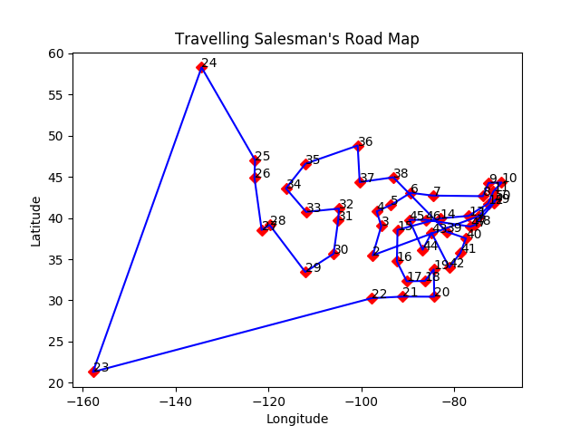

# Traveling Salesman

A Test Driven Development project to consider a simplified version of the travelling salesman problem.

A salesman must visit a distinct list of cities. The order does not matter but he does not want to visit the same city
twice, and would like his route to be the shortest possible. As this is a simplified version of the problem,
it is assumed the Earth is flat and Euclidean distances are used.

## Requirements

Install matplotlib by running `pip install matplotlib` through the command line,
or check [matplotlib.org](https://matplotlib.org/3.1.1/users/installing) for other installation options.

You need a file containing location data. Each line of the file needs to contain city, state, latitude and
longitude for one location, in a simple text format, separated by whitespaces.

If running the program within an IDE (e.g. PyCharm), enable scientific mode to view the populated graph instantly.

## Execution

- Import and run the main() function from cities.py
- When prompted, type the name of the file containing location data

## Data Representation

As the program runs, it will process the data and perform calculations to display the results in three ways.

1) An easy to read list of locations will be printed in the terminal console, displaying
city, state, latitude and longitude.

    EXAMPLE:
    - Phoenix, Arizona: 33.45, -112.07
    - Sacramento, California: 38.56, -121.47
    - Denver, Colorado: 39.74, -104.98

2) Once the route has been calculated, a second list is printed in the console to show each connected city and the
distance between them, followed by the total distance to travel.
    
    EXAMPLE:
    - Jackson, Mississippi to Nashville, Tennessee: 5.15
    - Nashville, Tennessee to Frankfort, Kentucky: 2.8
    - Frankfort, Kentucky to Columbus, Ohio: 2.57

3) The calculated route is plotted on a graph.  Each location is represented by a unique decimal number, which occupies
less space than displaying the city and state for each plot point. If running through an IDE terminal, the graph will be
 displayed instantly (ensure scientific mode is enabled). The graph is also saved as `road_map.png` within the project
 directory and opened using the operating system's default png image viewer.

    EXAMPLE:

